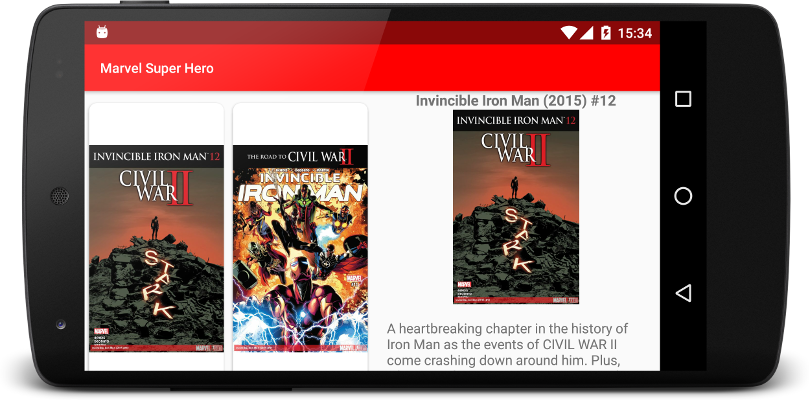

## Marvel Super Hero
## Details
* Clean Architecture & MVP
* Dagger 2 for dependency injection
* Retrofit as http client
* Picasso as image download manager
* Butterknife for view injection

## Developed using Marvel API
To use the source files, you will need to place your own public & privat API keys @ app/src/main/java/com/fivelabs/marvelsuperhero/app/dependencyinjection/DataSource.java

## Creator
Marvel Super Hero was created by and is maintained by **[Breogán González Fernández](https://twitter.com/breogangf)**

* [Twitter](https://twitter.com/breogangf)
* [Github](https://github.com/breogangf)
* [LinkedIn](https://www.linkedin.com/in/breogangf)

## Screenshots

